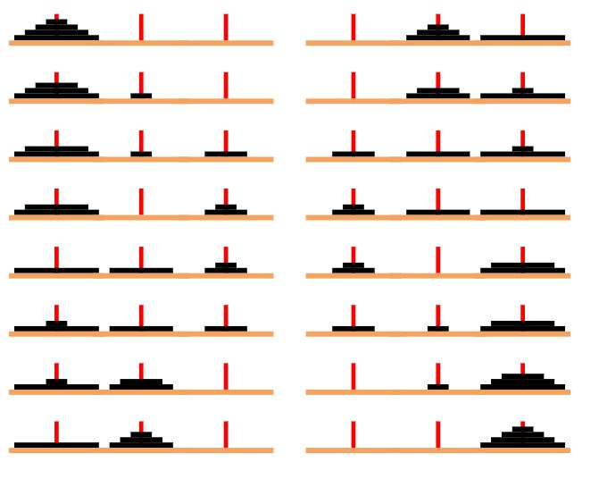

# Tower of Hanoi Solver 🧩🔀

This repository contains a Python program that solves the classic Tower of Hanoi problem using recursion. The Tower of Hanoi is a mathematical puzzle consisting of three rods and a number of disks of different sizes, which can slide onto any rod. The puzzle starts with the disks in a neat stack in ascending order of size on one rod, the smallest at the top, thus making a conical shape. The objective of the puzzle is to move the entire stack to another rod, obeying the following rules:

1. Only one disk can be moved at a time.
2. Each move consists of taking the upper disk from one of the stacks and placing it on top of another stack.
3. No disk may be placed on top of a smaller disk.

## Features 🎯

- The program uses recursion to solve the Tower of Hanoi problem.
- It prints the sequence of moves to solve the puzzle.

## Usage 📖

To use this program, run the Python script and enter the number of disks when prompted. The program will then print the sequence of moves to solve the Tower of Hanoi problem with the given number of disks.

