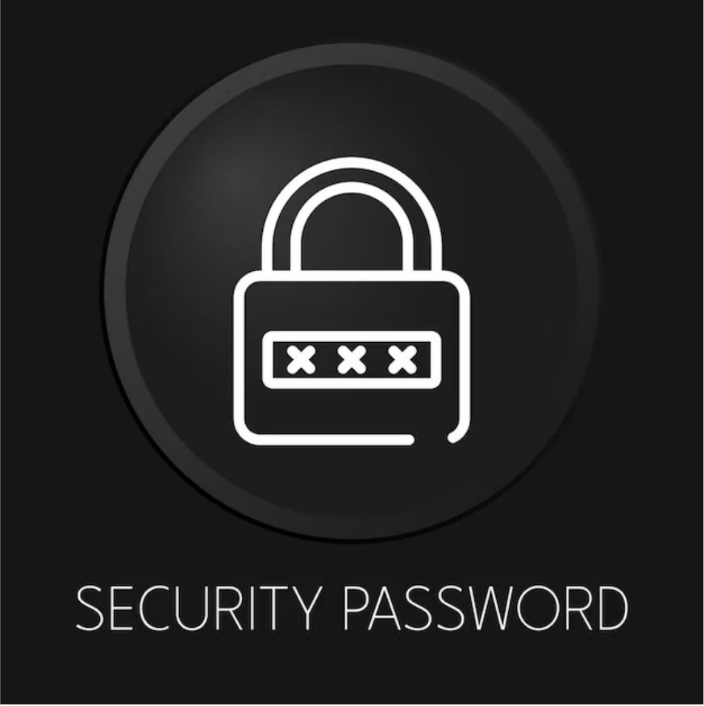
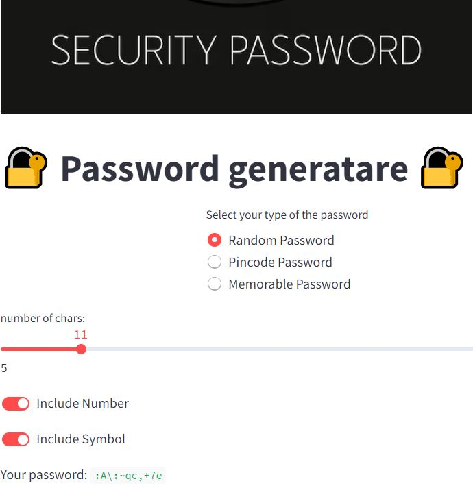

# <center> Password Generator

<p align="center">
 
</p>


This project is a password generator developed using Streamlit, a fast and lightweight web framework for building machine learning and data science web applications. The application allows users to generate passwords of different types: Random Password, Pincode Password, and Memorable Password.


## Getting Started

These instructions will get you a copy of the project up and running on your local machine for development and testing purposes.


You can install the required packages using pip:

```bash
pip install streamlit nltk
```

### Installing

Clone the repository:

```bash
git clone https://github.com/username/password-generator.git
cd password-generator
```

Then, run the Streamlit app:

```bash
streamlit run app.py
```

Replace `app.py` with the path to your Streamlit script.

## Usage

Once the Streamlit app is running, you can interact with it in your web browser. Select the type of password you want to generate using the radio buttons, adjust the settings according to your needs, and click the button to generate the password.

## Built With

- [Streamlit](https://streamlit.io/) - The web framework used
- [NLTK](https://www.nltk.org/) - Used for generating memorable passwords


## Screenshot


<p align="center">
 
</p>

