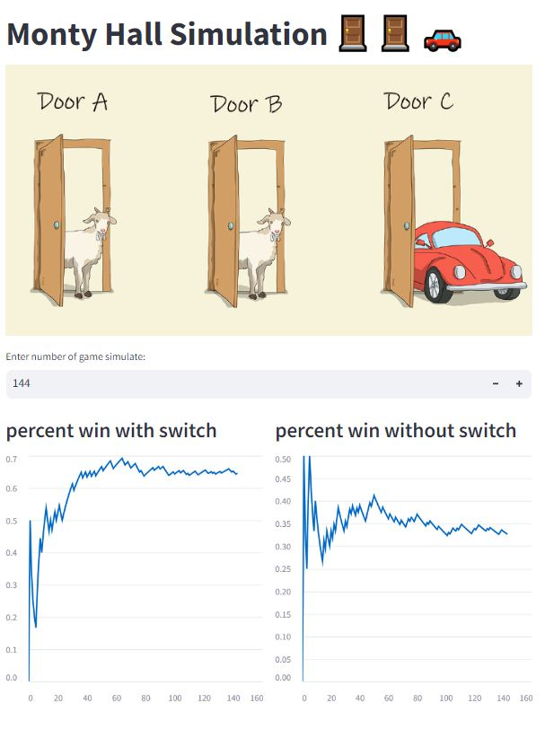

# Monty Hall Simulation

This project is a Streamlit application that simulates the Monty Hall problem. The Monty Hall problem is a probability puzzle based on a game show scenario. The problem is named after Monty Hall, the original host of the American television game show Let's Make a Deal.

## Getting Started

These instructions will get you a copy of the project up and running on your local machine for development and testing purposes.

### Prerequisites

Before you begin, ensure you have met the following requirements:

- You have installed the latest version of Python
- You have installed the required packages (`streamlit`, `time`, `monty_hall`)

To install the required packages, you can use pip:

```bash
pip install streamlit time monty_hall
```


## How to Use the Application

The application is straightforward to use. It starts by displaying a title and an image. Then, it asks the user to enter the number of games to simulate. After that, it creates two columns to display the percent win with switch and without switch.

For each game, it calls the `simulate` function from the `monty_hall` package. The result of the simulation is added to the total wins for switching and not switching. The percentage win for each strategy is calculated and added to the corresponding chart.

## Built With

- [Streamlit](https://streamlit.io/) - The framework used for building the application
- [Time](https://docs.python.org/3/library/time.html) - Used for time-related functions
- [Monty Hall](https://pypi.org/project/monty-hall/) - Used for simulating the Monty Hall problem


# In the last you can see this page
